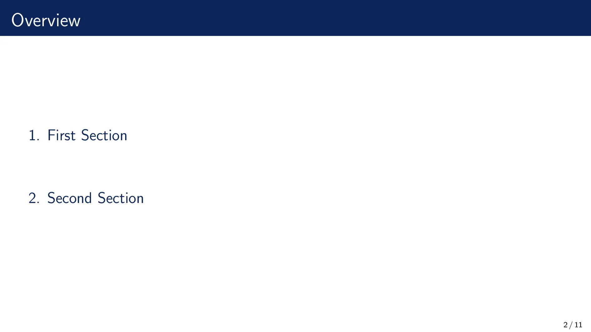
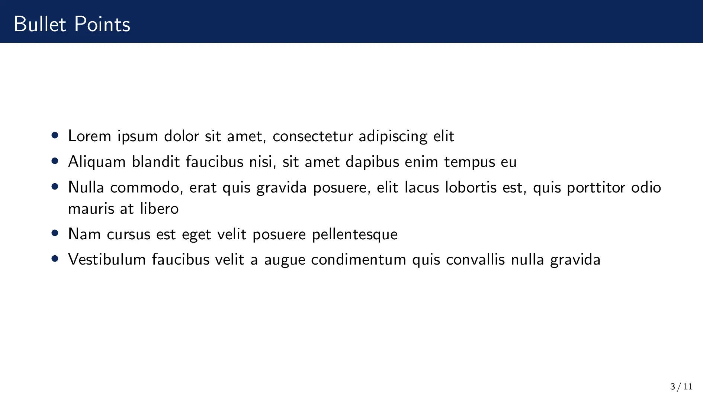
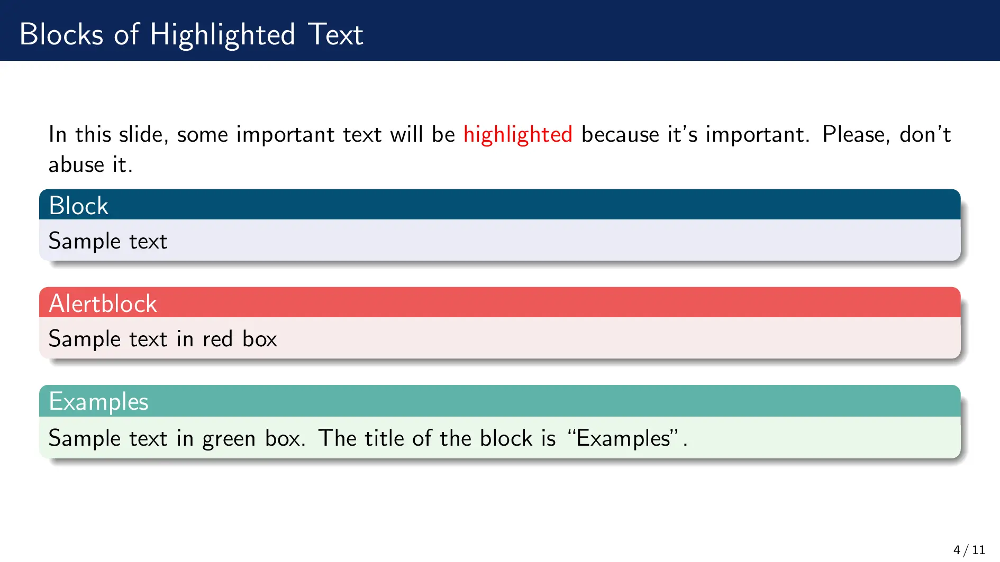
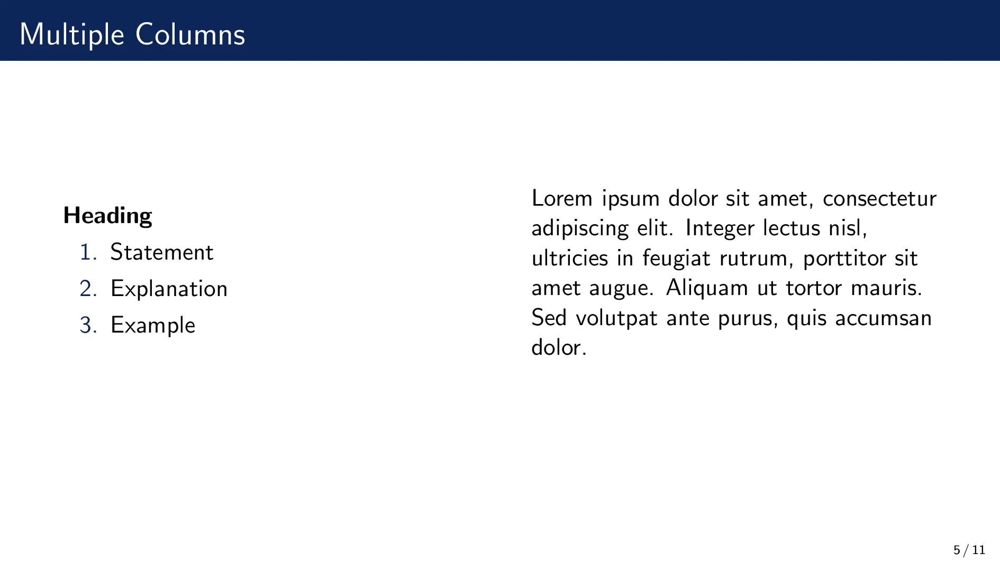
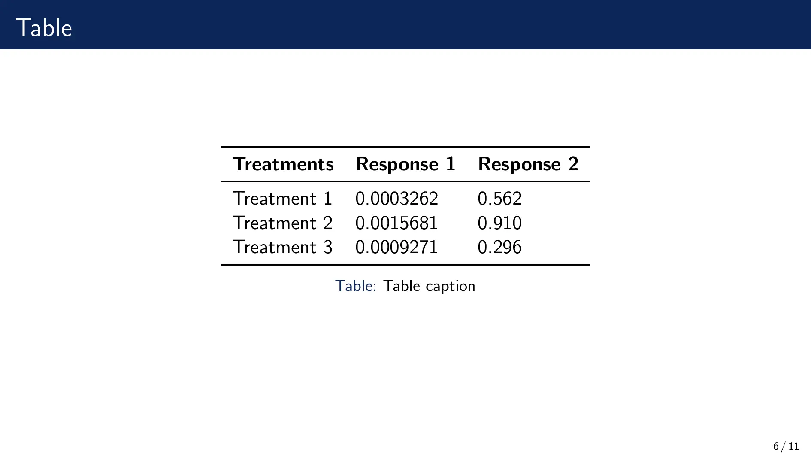
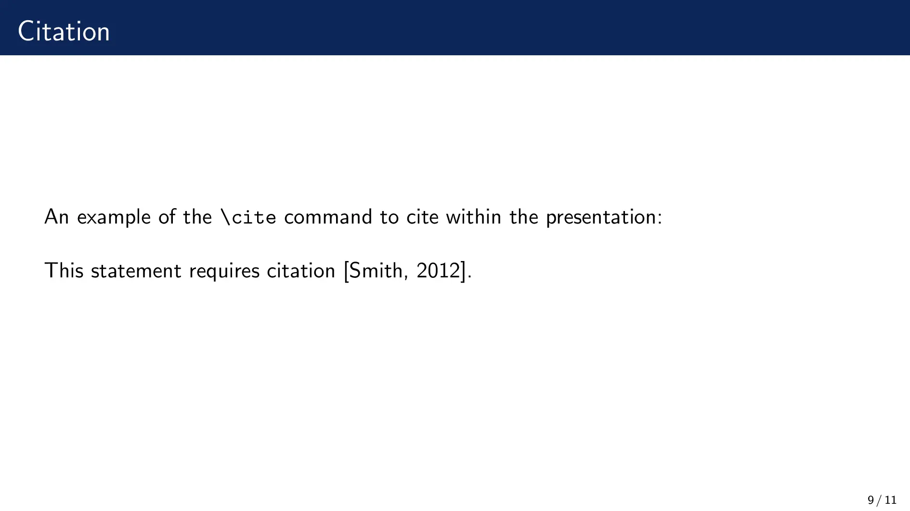
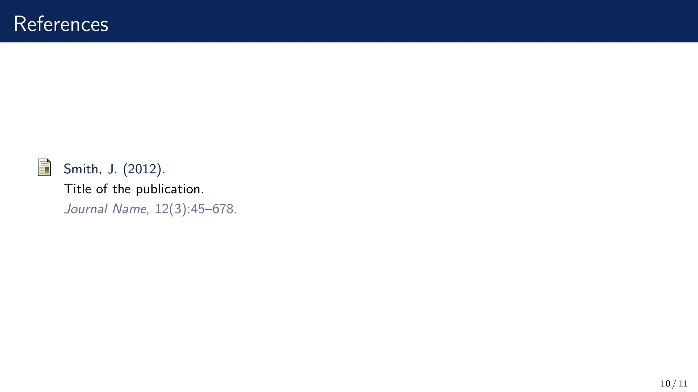

# 🫐 SimpleDarkBlue Beamer Theme

The SimpleDarkBlue Beamer Theme is a simple template designed for academic and scientific presentations, with dark blue as the main color.

You can find the SimpleDarkBlue Beamer Theme on [Overleaf](https://www.overleaf.com/latex/templates/simple-beamer-theme/cyjyxkdttqzs) or [CTAN](https://ctan.org/pkg/beamertheme-simpledarkblue). The Overleaf link provides an easy-to-use web-based LaTeX editor, while the CTAN link allows you to download the template files for use in your own LaTeX environment.

* Overleaf: [https://www.overleaf.com/latex/templates/simple-beamer-theme/cyjyxkdttqzs](https://www.overleaf.com/latex/templates/simple-beamer-theme/cyjyxkdttqzs)  
* CTAN: [https://ctan.org/pkg/beamertheme-simpledarkblue](https://ctan.org/pkg/beamertheme-simpledarkblue)

> If you like this theme, you may also be interested in my other beamer theme, [🍃SimplePlus](https://github.com/PM25/SimplePlus-BeamerTheme).

## Preview

Here are some preview images of the SimpleDarkBlue Beamer Theme:

Hope that you find the SimpleDarkBlue Beamer Theme to be a useful and effective tool for your academic and scientific presentations. Please let me know if you have any feedback or suggestions for improvement.

## License
This project is licensed under the Unlicense License - see the [LICENSE](./LICENSE) file for more details.
